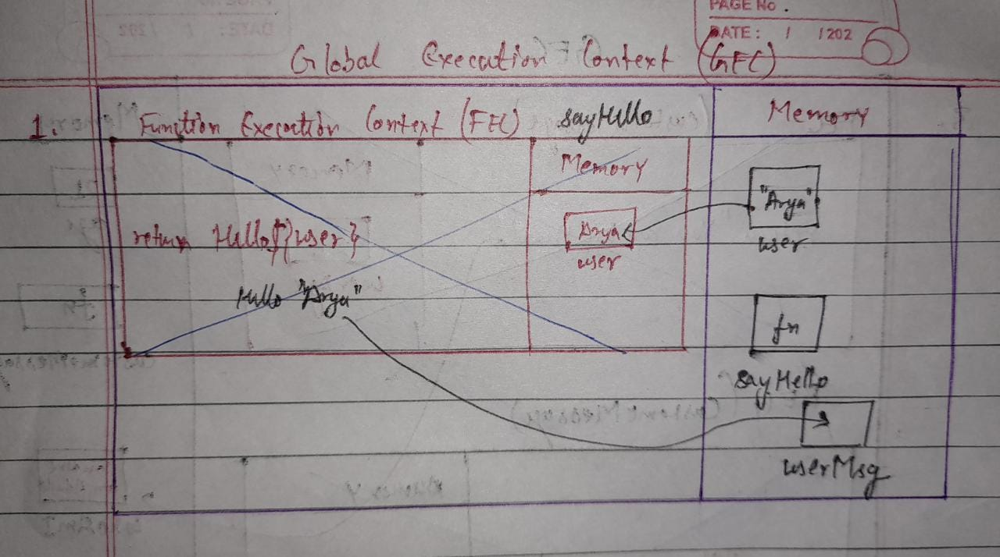
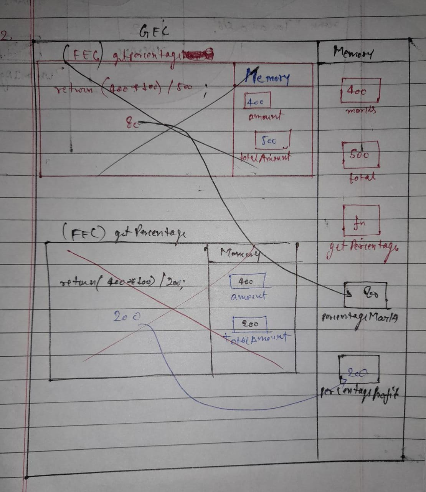
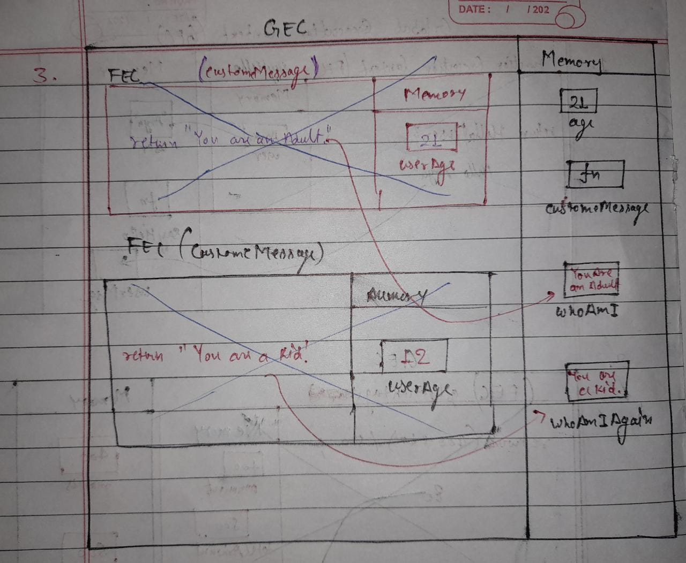

1. What does thread of execution means in JavaScript?
   ANS: The JavaScript Executes the code line by line and is known as Thread of execution.(i.e. executing second line after first line.)

2. Where the JavaScript code gets executed?
   ANS:JavaScript code gets executed in JavaScript Engine.
   As code execution starts, JavaScript creates a Global Execution Context, in which there is a specific memory section. All variables and function are stored in memory, and when it comes to execute a function, a "Function Execution Context" is formed inside the GEC, which also have a memory section. After execution of function the value is stored and the FEC is deleted and then next line is executed.

3. What does context means in Global Execution Context?
   ANS:It means environment in which any code gets executed.

4. When do you create a global execution context.
   ANS: It is created once when the code/program execution is started.

5. Execution context consists of what all things?
   ANS:
   1st part: Where all data, functions and variables are stored.
   2nd Part: Where all functions like operations and manipulation are executed.

6. What are the different types of execution context?
   ANS: Global execution context and function execution context.

7. When global and function execution context gets created?
   ANS: As code execution starts, JavaScript creates a "Global Execution Context" and when it comes to execute a function, a "Function Execution Context" is crested.

8. Function execution gets created during function execution or while declaring a function.
   ANS: During executing function.

9. Create a execution context diagram of the following code on your notebook. Take a screenshot/photo and store it in the folder named `img`. Use `` to display it here.

```js
var user = "Arya";

function sayHello() {
  return `Hello ${user}`;
}

var userMsg = sayHello(user);
```

<!-- Put your image here -->



```js
var marks = 400;
var total = 500;

function getPercentage(amount, totalAmount) {
  return (amount * 100) / totalAmount;
}

var percentageMarks = getPercentage(marks, total);
var percentageProfit = getPercentage(400, 200);
```

<!-- Put your image here -->



```js
var age = 21;

function customeMessage(userAge) {
  if (userAge > 18) {
    return `You are an adult`;
  } else {
    return `You are a kid`;
  }
}

var whoAmI = customeMessage(age);
var whoAmIAgain = customeMessage(12);
```

<!-- Put your image here -->


